<div align="center">


# TokenFuse for iPhone & Apple Watch

### Hold the Breaker on your agents.

The out-of-band control for **TokenFuse**, the runtime kill-switch for AI agents. Watch every agent's burn live, see what you're saving, and pull the **Breaker** (signed on-device by the Secure Enclave) from your phone or your wrist.


</div>

---

This is the native **iPhone + Apple Watch** app for **[TokenFuse](https://github.com/TAIPANBOX/tokenfuse)**, the runtime kill-switch for AI agents: a proxy that caps what your agents can spend and cuts them off the instant they blow past budget. TokenFuse's proxy does the enforcing in-line; this app is the **out-of-band control** you carry: an independent, hardware-rooted way to pull the **Breaker** that keeps working even if the agent's own host is the thing running away or compromised. See every agent's burn rate live, get alerted the moment one runs hot, and stop it with a kill that's signed on-device by your device's **Secure Enclave**.

> Everything here is free and open (Apache-2.0, self-host): the CLI, the local proxy, the **Cloud** control plane, and the [Genaryx](https://github.com/TAIPANBOX/genaryx) console whose relay powers this app's remote **Pocket** mode below. There is no paid tier anywhere in the stack, and nothing is sold. This app pairs with the plane you run yourself.

<div align="center">

<table>
<tr>
<td width="25%">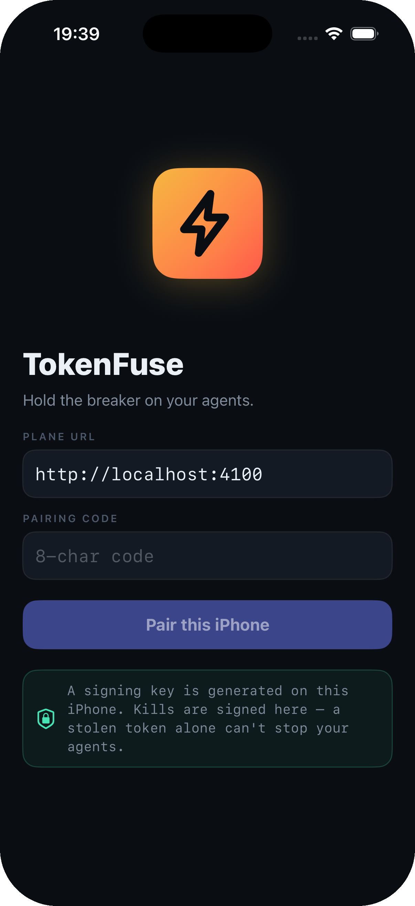</td>
<td width="25%">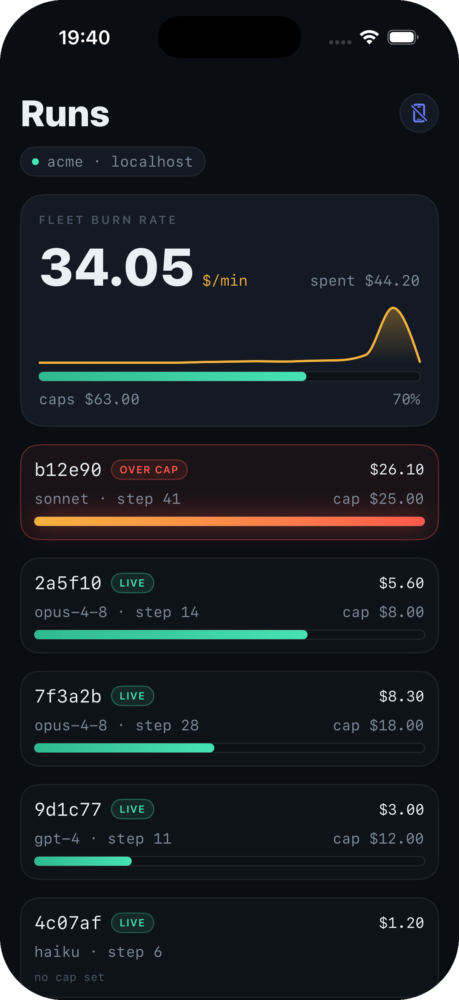</td>
<td width="25%">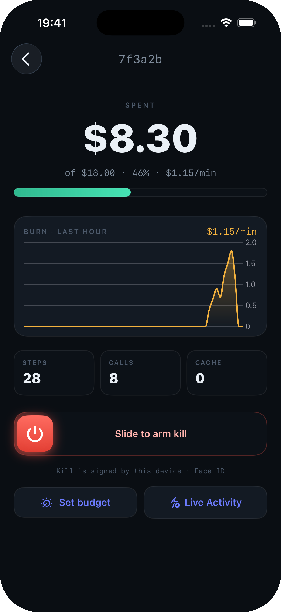</td>
<td width="25%">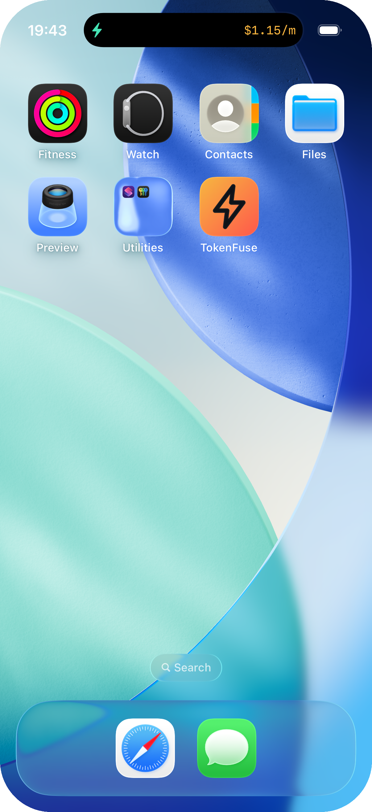</td>
</tr>
<tr>
<td align="center"><sub>Pair once · key in the Enclave</sub></td>
<td align="center"><sub>Fleet burn rate, live</sub></td>
<td align="center"><sub>Burn chart · slide-to-arm kill</sub></td>
<td align="center"><sub>Dynamic Island</sub></td>
</tr>
</table>

</div>

---

## 🤔 What is this, in plain words?

A chatbot makes **one** call to an AI model. An **agent** makes *hundreds*: it thinks, calls a tool, reads the result, thinks again, and loops. That loop is what makes agents useful, and it's also what makes them dangerous. A stuck agent keeps calling the model, and the meter keeps spinning. Nothing looks broken (it still returns `200 OK`), so the **bill is often the first sign something went wrong**, and by then the money is gone.

**[TokenFuse](https://github.com/TAIPANBOX/tokenfuse)** is a small proxy you put between your agents and their AI provider. It adds up the real cost of every call as it happens and, the instant an agent blows past its budget, it cuts the circuit before the damage lands.

**This app is the human in that loop.** You can't stare at a dashboard all day, and when something goes wrong you want to stop it *right now*, from wherever you are. So the app puts the whole fleet on your **iPhone** and your **Apple Watch**:

- **See** every agent's spend and burn rate, live.
- **Get alerted** the moment one runs hot.
- **Pull the Breaker** on a runaway agent in two taps, signed by a key that lives in your device's **Secure Enclave**, so it can't be forged.

You don't need to be an engineer to use it: pair once, and the fleet is right there. Green while you're safe, warming to amber, red when an agent is over budget.

---

## 🔒 Why the Breaker needs an app (and a signature)

Stopping an agent mid-task is a powerful, destructive action, so it has to be **authenticated**. If pulling the Breaker were just an API call with a token, then anyone who stole that token could shut your agents down, or, just as bad, a compromised or runaway agent host could suppress the stop from reaching the proxy at all.

TokenFuse solves this with **hardware-backed signing** on a *separate* device. When you pair this app, it generates a private key **inside the device's Secure Enclave**, a chip that never lets the key out, not even to the app itself. Every Breaker pull (and every budget change) is signed by that key on-device. The control plane verifies the signature before it acts. The result:

- A stolen **API token alone can't fire the Breaker**, because it isn't the signing key.
- A stolen **phone can't fire the Breaker** either, because the slide-to-arm control is behind **Face ID**.
- The Breaker is **enforced across every gateway** in your fleet, instantly, from a device that's independent of whatever the agent is running on.

This is the differentiator a first-party, in-process control can't match: a signed kill that comes from *outside* the agent's own host, so it still works when that host is exactly what's misbehaving. This is the heart of the design: *the Breaker is in your hand, and only your hand can pull it*, signed on-device by the Secure Enclave, not merely "an API call with extra steps."

---

## ✨ What it does

### 📱 iPhone

- **Live fleet.** Every run with its spend and **burn rate** (`$/min`), sorted hottest-first, over-budget runs in red.
- **The fuse.** A signature burn meter that heats **mint → amber → ember** as spend approaches the cap. One glance tells you who's in trouble.
- **Run detail.** A **burn chart** for the last hour, plus steps / calls / cache-hits.
- **Slide-to-arm the Breaker.** A deliberate, two-step control behind **Face ID**, signed by the Secure Enclave.
- **Per-run budgets.** Set or change a run's cap right from your phone.
- **Dynamic Island & Lock Screen.** The burn rate rides along while you do other things (a **Live Activity**).
- **Notifications.** A nudge the moment a run crosses its cap.

The app isn't only the Breaker. It mirrors the same **FinOps and governance** view the [web dashboard](https://github.com/TAIPANBOX/tokenfuse/tree/main/cloud/dashboard) shows, so the whole picture is on your phone:

- **Savings.** A running "saved this month" headline, broken down into the three ways TokenFuse avoids spend: budget blocks on runaway runs, semantic-cache hits, and the model router picking a cheaper model. This is the FinOps value in one glance.
- **Per-agent spend.** Cost rolled up by agent (with an explicit *unattributed* bucket), for a multi-agent fleet.
- **Incidents.** The fleet's anomalies (budget exhausted, sustained loop, spend spike, fan-out explosion), each with a severity, and a **Face-ID-signed acknowledge**.
- **Governance.** Read-only compliance evidence mapped to **EU AI Act**, **Fed SR 11-7**, and **SOC 2** (each control graded Enforced / Partial / Documented), the tamper-evident **audit trail** with a live chain-verify, and a per-run **replay** timeline. Evidence, not a certification.

The FinOps and governance surface, live against a control plane:

<div align="center">

<table>
<tr>
<td width="33%">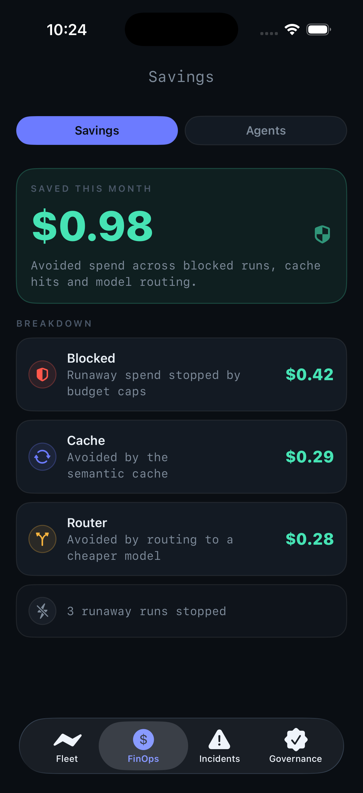</td>
<td width="33%">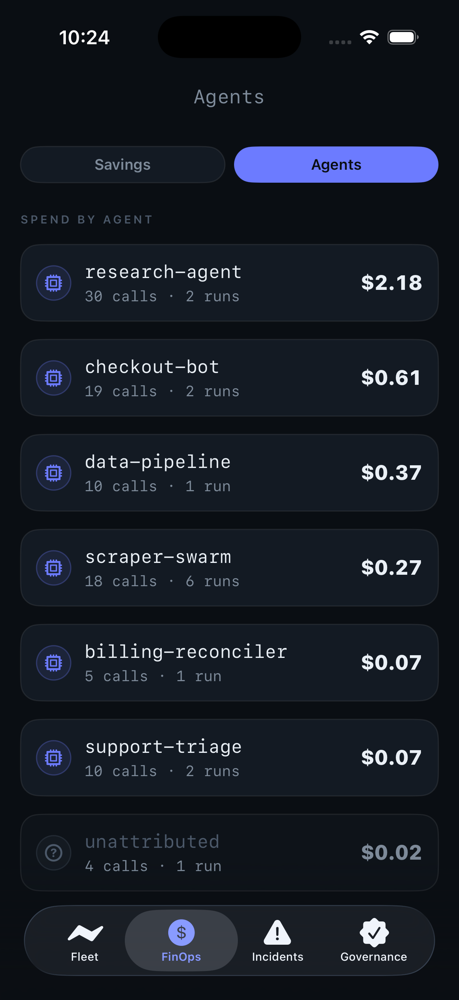</td>
<td width="33%">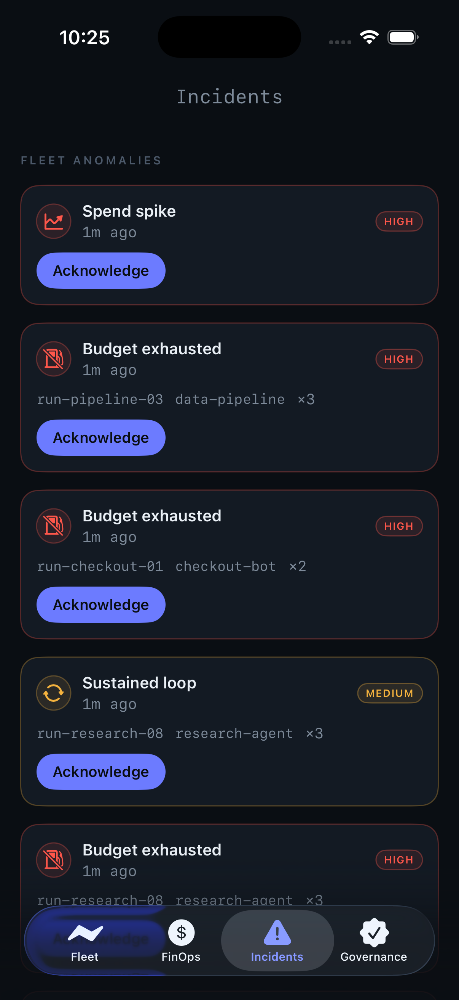</td>
</tr>
<tr>
<td align="center"><sub>Saved this month · blocked / cache / router</sub></td>
<td align="center"><sub>Spend by agent</sub></td>
<td align="center"><sub>Incidents · Face-ID-signed ack</sub></td>
</tr>
<tr>
<td width="33%">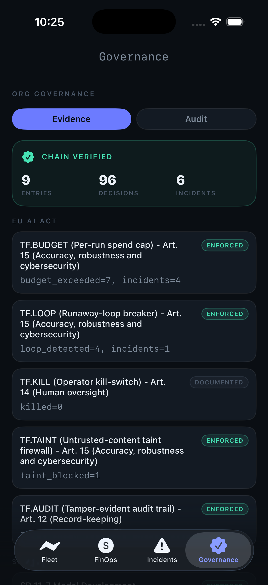</td>
<td width="33%">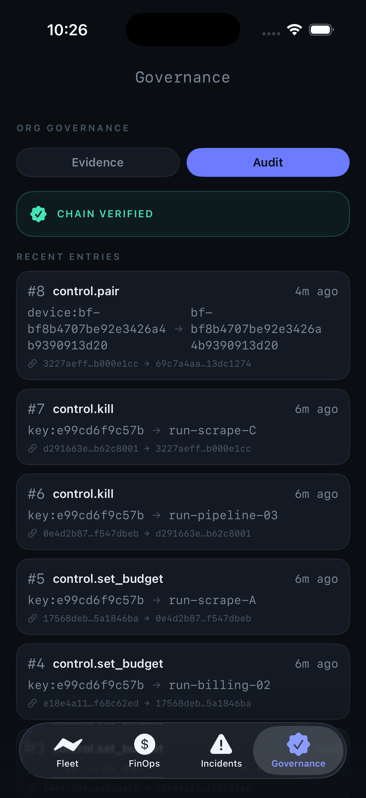</td>
<td width="33%">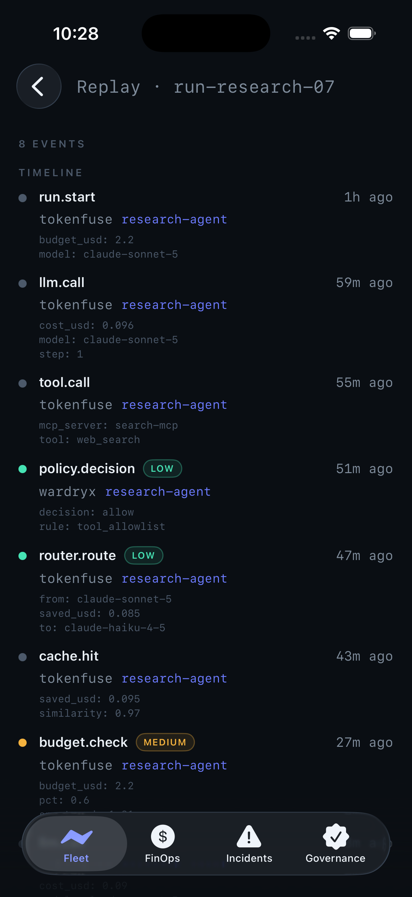</td>
</tr>
<tr>
<td align="center"><sub>Evidence · EU AI Act / SR 11-7 / SOC 2</sub></td>
<td align="center"><sub>Tamper-evident audit · chain-verify</sub></td>
<td align="center"><sub>Per-run replay timeline</sub></td>
</tr>
</table>

</div>

> These are live captures from the iOS Simulator paired to a real TokenFuse control plane with seeded demo traffic (a fleet of agents, cache/router savings, a few runaway runs stopped, and the four incident detectors tripped). Nothing here is mocked in the app; every number is decoded from the control-plane API.

### ⌚ Apple Watch

- **Fleet glance.** The fleet burn rate and every run as a fuse, on your wrist.
- **Pull the Breaker from the wrist.** Tap a run, tap **Kill**. It's *signed on the Apple Watch* by its own device key.
- **Face complication.** The burn rate rides on your **watch face**, amber normally and red when a run is over cap. No app to open.

<div align="center">

<table>
<tr>
<td width="33%">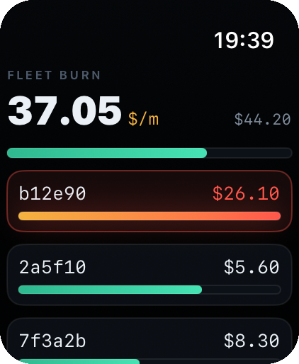</td>
<td width="33%">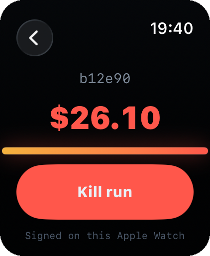</td>
<td width="33%">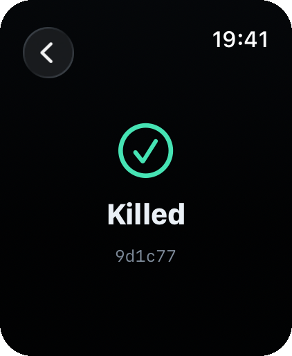</td>
</tr>
<tr>
<td align="center"><sub>Fleet burn rate</sub></td>
<td align="center"><sub>Signed on the Apple Watch</sub></td>
<td align="center"><sub>Killed</sub></td>
</tr>
</table>

</div>

---

## 📟 TokenFuse Pocket: the relay-paired remote pager

Everything above pairs the app **directly** to a control plane it can reach on
your network. **Pocket** (D12) is the second mode, built for the case where you
are away from that network and only want to hear about exceptions: the phone
(and the watch, independently) pairs **once, by QR, one device**, to the
Genaryx relay running next to the stack, and the relay pushes only what needs a
human: an over-cap run, opened straight into the signed-kill flow.

Built and verified sim-first against a live stack:

- **Exception-first queue.** The relay serves a bounded read slice (money +
  agents); the phone renders the exception, not a firehose.
- **The money surface (D14).** One pinned shell: spend, savings, and the agent
  list with each row saying which axis it is on; tap an agent to open it.
- **Findings carry provenance.** When a detection came from somewhere else in
  the stack (an Idryx identity finding, not a TokenFuse budget trip), the card
  says so. Verified live end to end: a real Idryx detection reached the phone
  through Cloud and the relay.
- **Felyx annotation.** The Genaryx copilot's triage note (read + propose,
  never act) renders on the exception card, so the page arrives with context.
- **Wrist exceptions.** The watch has its own relay client: exception-only, its
  own signed kill, and **honest revocation**; a deauthorized device says it was
  deauthorized instead of pretending to be paired.
- **Hardened paths.** Signed mutation paths percent-encode dynamic ids, the
  campaign-era ATS exception is gone from both targets, and neither target
  ships `NSAllowsArbitraryLoads`: the relay path is pinned HTTPS, the
  dev-harness path is plain HTTP scoped to the local network only.

Pocket needs the Genaryx relay, which is what makes it remote; the rest of the
stack stays fully usable locally without a phone. Real-device APNs push and
store distribution wait on the Apple Developer account, so mobile is a side
project: the present tense of this stack is the web console on your own box.

---

## 🎨 One identity: *the fuse*

Everything you see is built around a single idea: **a fuse that carries current until it must break the circuit.** The same visual language runs across the iPhone, the Apple Watch, and the [web dashboard](https://github.com/TAIPANBOX/tokenfuse/tree/main/cloud/dashboard), so the tool feels like one product, not three.

| Colour | Meaning |
|---|---|
| 🟢 **Mint** | Within budget. All good. |
| 🟡 **Amber** | Warming. Nearing the cap. |
| 🔴 **Ember** | Over cap, or the kill. |

The mark itself, an amber→ember tile with a black-keyline bolt, is the app icon, the pairing screen's emblem, and the dashboard's logo, all the same. Interactive design mockups live in [`docs/`](docs/) and run live at [taipanbox.github.io/tokenfuse-mobile](https://taipanbox.github.io/tokenfuse-mobile/) (simulated data, numbers tick in the browser).

---

## 🚀 Build & run

You **don't need a paid Apple Developer account** to try it. It runs in the Simulator, or on a real device with a free Apple ID. (Only real remote push delivery and the App Store need the paid account.)

**Requirements:** macOS with **Xcode**, and **[XcodeGen](https://github.com/yonaskolb/XcodeGen)**. The Xcode project is generated from [`ios/project.yml`](ios/project.yml), so it stays reviewable as text and is never committed.

```bash
brew install xcodegen
cd ios
xcodegen generate
open TokenFuse.xcodeproj
```

Then pick a scheme and run:

- **`TokenFuse`** builds the iPhone app (it embeds the widget for the Dynamic Island).
- **`TokenFuseWatch`** builds the Apple Watch app (it embeds the face complication).

On first launch you **pair** the app to a TokenFuse **plane** (the control-plane server) with a one-time code. To spin up a plane locally, see the [main TokenFuse repo](https://github.com/TAIPANBOX/tokenfuse): in short, `cd cloud && docker compose up`, then create a pairing code from the dashboard.

---

## 🏗️ Architecture

A single SwiftUI codebase, shared across phone and watch.

- **SwiftUI · Swift 6** with strict concurrency; `@Observable` state, **SwiftData** for an offline cache, **Swift Charts** for the burn history.
- **WidgetKit** powers the Dynamic Island / Lock-Screen **Live Activity** on iPhone, and the **watch-face complication** (fed from the app over an App Group).
- **CryptoKit / Secure Enclave** handle device pairing and **ES256-signed** kills and budget changes. The exact wire protocol (canonical signing string, key formats) mirrors the gateway's, so a kill signed here is verified there.
- **Generated API layer.** The typed client mirrors [`ios/openapi.json`](ios/openapi.json), the same OpenAPI contract the control plane publishes. It tracks the current contract, including the FinOps and governance reads (savings, per-agent spend, incidents, compliance evidence, audit, replay) The `402 plan_required` variant is still PARSED, so an app pointed at an older Cloud reports the refusal honestly rather than going blank, but nothing current sends it.
- **XcodeGen.** The project is defined in YAML, not a binary `.pbxproj`, so changes are readable in a diff.
- **Relay mode (Pocket).** A second transport beside the direct plane client: pairing and reads go to the Genaryx relay's bounded surface, and every mutation stays an Enclave-signed request the box verifies, so the relay carries pages and reads, never authority. Signed mutation paths percent-encode dynamic ids.

The iPhone and Apple Watch apps share the design system, the API layer, and the signing code; each adds only its own screens.

---

## 📊 Status

- **iPhone app: complete.** Organized into four tabs (Fleet · FinOps · Incidents · Governance). Pairing, live fleet, run detail with burn charts, Face-ID and Enclave-signed kill and budgets, notifications, Dynamic Island / Live Activity, app icon. The FinOps tab adds the savings headline and per-agent spend; Incidents adds the anomaly feed with a signed acknowledge; Governance adds compliance evidence, the audit trail with chain-verify, and per-run replay. Every screen is verified live against a real control plane on the simulator.
- **Apple Watch app: complete.** Live fleet, wrist-signed kill, and the face complication.
- **TokenFuse Pocket (relay mode): built, sim-first.** QR single-device pairing to the Genaryx relay, exception-first push opening into the signed-kill flow, the money surface behind one pinned shell, cross-service finding provenance (verified live end to end: Idryx → Cloud → relay → phone), the Felyx annotation on the exception card, and the watch's own relay client with honest revocation and deauthorization.
- **Deferred** (needs a paid Apple Developer account or real paired devices): real remote **push** delivery, an **App Store** release, and hand-off of the session from the paired iPhone to the Watch over WatchConnectivity (today the Watch pairs on its own).

It has **not** had a production hardening pass or a security review, so treat it as an early, capable app you can build and evaluate today.

**This is a side project, not part of the stack.** The stack is the web console
and the services beside it, which run on the operator's own box and carry their
own measurements. Nothing here is wired into them, nothing here is verified the
way they are, and it moves when there is time for it.

---

## 🔗 Links

- **[TokenFuse](https://github.com/TAIPANBOX/tokenfuse)** is the gateway + Cloud control plane this app talks to.
- **[Genaryx](https://github.com/TAIPANBOX/genaryx)** is the browser control room over the whole stack; its relay is what **Pocket** pairs through.
- **[Web dashboard](https://github.com/TAIPANBOX/tokenfuse/tree/main/cloud/dashboard):** the same fleet, the same *fuse*, in a browser.
- **[Design system](https://github.com/TAIPANBOX/tokenfuse/blob/main/docs/16-design-system.md)**
- **[`docs/`](docs/):** interactive iPhone / Watch / dashboard mockups, served live at [taipanbox.github.io/tokenfuse-mobile](https://taipanbox.github.io/tokenfuse-mobile/).

---

## 📄 License

[Apache-2.0](LICENSE).
